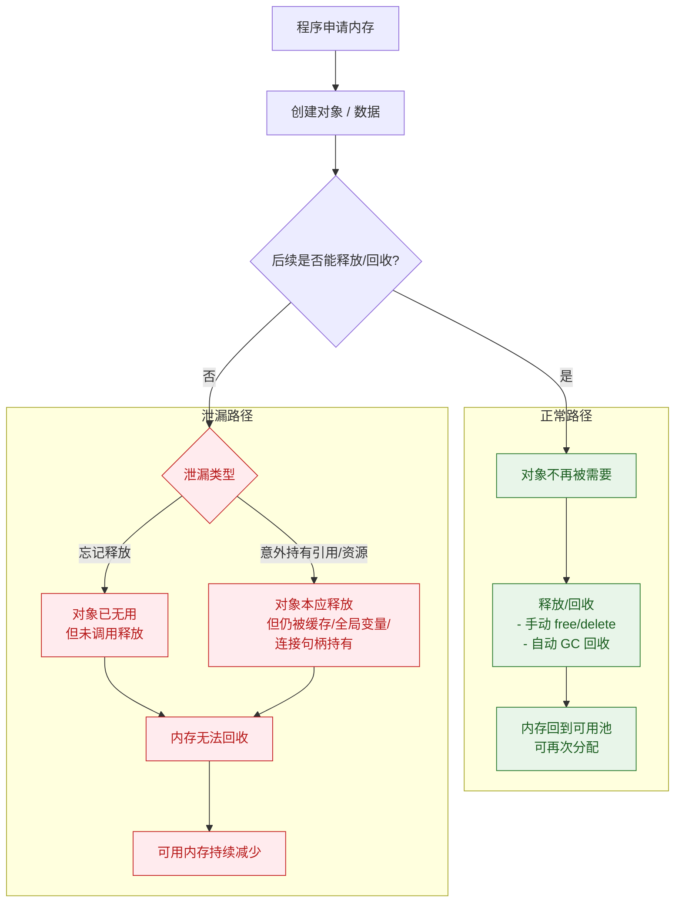

## 内存泄漏是？
**内存泄漏**指的是计算机程序**错误地保留了不再需要使用的内存**，导致系统可用内存逐渐减少，如同水池有个关不紧的水龙头在持续漏水。

为了帮你直观理解程序从创建对象到发生泄漏的全过程，可以看下面的流程图：

### 🔍 为什么会发生内存泄漏？
主要原因包括：
*   **程序员疏忽**：在C/C++等语言中，用 `malloc` 或 `new` 申请内存后，忘记了 `free` 或 `delete`。
*   **设计缺陷**：例如，对象被意外地长期引用（如放入全局缓存却未清理），或存在**循环引用**（两个对象互相引用，某些垃圾回收机制无法处理）。
*   **资源未释放**：未关闭文件、数据库连接、网络连接等。

### ⚠️ 内存泄漏有哪些危害？
其危害是累积性的：
1.  **程序性能下降**：可用内存减少，系统可能开始频繁使用硬盘作为虚拟内存（交换空间），导致程序变慢、响应延迟。
2.  **系统不稳定**：内存耗尽时，可能导致当前程序崩溃，甚至影响整个操作系统的稳定性。
3.  **长期运行的服务瘫痪**：对于服务器、数据库等需要**7x24小时运行**的程序，微小的泄漏日积月累足以导致服务中断。

### 🛠️ 如何预防和发现内存泄漏？
*   **良好的编程习惯**：谁申请，谁释放。在C/C++中严格配对，在Java、Python等有垃圾回收的语言中，注意**及时将对象引用置为null**，并避免不必要的全局引用和循环引用。
*   **使用智能指针**（C++）：如 `std::shared_ptr`, `std::unique_ptr`，可自动管理内存生命周期。
*   **使用专业工具检测**：
    *   **Valgrind**（Linux/C/C++）：神器级的内存调试工具。
    *   **Xcode Instruments**（macOS/iOS）：用于检测Apple平台应用。
    *   **Visual Studio Diagnostic Tools**（Windows/.NET）：用于.NET应用。
    *   **Chrome DevTools**（JavaScript/Web）：分析网页内存使用。

### 💎 核心要点
简单来说，内存泄漏就像是**程序“忘了”把借来的内存还给系统**。虽然现代高级语言（Java, Go, Python等）通过**自动垃圾回收**机制大大减少了此类问题，但**并非绝对免疫**。如果代码创建了垃圾回收器无法回收的“**垃圾**”（如循环引用、未关闭的连接），泄漏依然会发生。